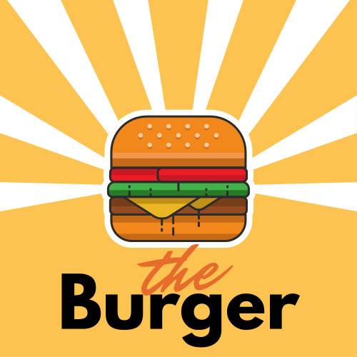
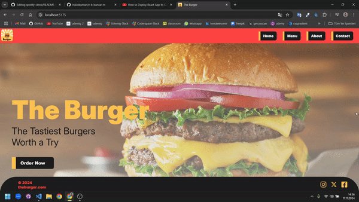
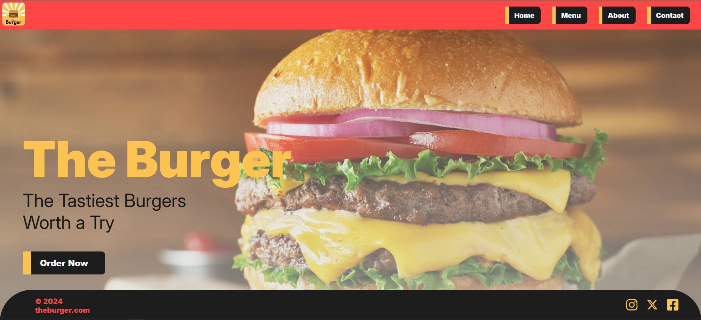
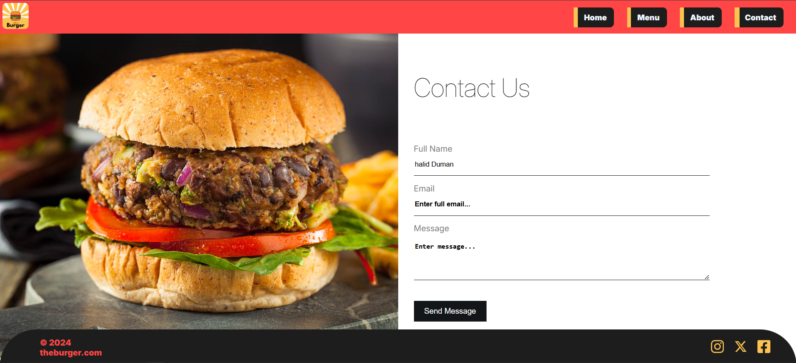

# THE Burger

  

Bu proje, React ile oluşturduğum ilk web sitesi çalışmasıdır. Site içerisinde toplam 4 sayfa bulunmaktadır: **Home**, **Menu**, **About**, ve **Contact**. Bu sayfalar arasında geçiş yaparken **React Router** kullanılmıştır.
<<<<<<< HEAD

  

## Özellikler

- **Responsive Tasarım**: Tüm sayfalar, farklı ekran boyutlarına uyumlu olacak şekilde tasarlanmıştır.
- **React Router**: Kullanıcıların sayfalar arasında hızlı bir şekilde geçiş yapabilmesi için React Router kullanılmıştır.
- **Modern Arayüz**: Kullanıcı dostu, sade ve modern bir tasarım uygulanmıştır.

  

## Kullanılan Teknolojiler

- **React**: Arayüz bileşenleri oluşturmak için.
- **React Router**: Sayfa geçişleri sağlamak için.
- **CSS**: Tasarım ve düzenlemeler için.

  
  

 

<a href="/" style="font-size: 24px;color: green;">Web Siteye Şuanlık Erişilemiyor.</a>
=======

  

## Özellikler

- **Responsive Tasarım**: Tüm sayfalar, farklı ekran boyutlarına uyumlu olacak şekilde tasarlanmıştır.
- **React Router**: Kullanıcıların sayfalar arasında hızlı bir şekilde geçiş yapabilmesi için React Router kullanılmıştır.
- **Modern Arayüz**: Kullanıcı dostu, sade ve modern bir tasarım uygulanmıştır.

  

## Kullanılan Teknolojiler

- **React**: Arayüz bileşenleri oluşturmak için.
- **React Router**: Sayfa geçişleri sağlamak için.
- **CSS**: Tasarım ve düzenlemeler için.

  
  

 

<a href="/" style="font-size: 24px;color: green;">Web Siteye Şuanlık Erişilemiyor.</a>

>>>>>>> f794ae025675620b3be033276ae491a93ad57e27
